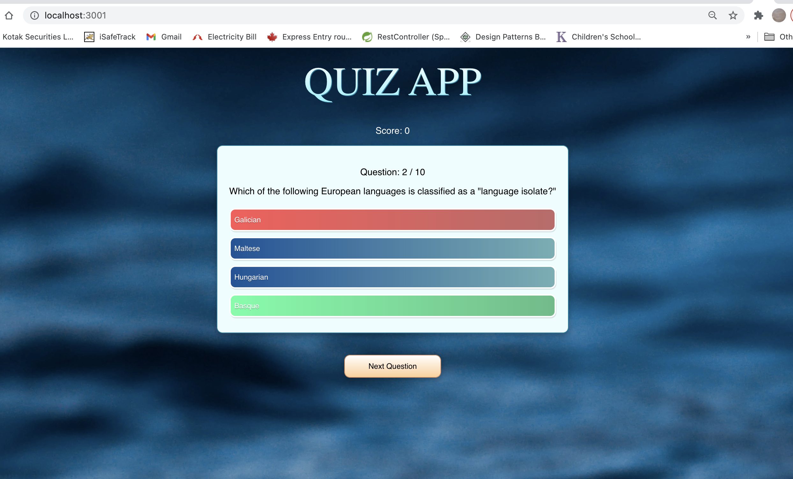

# Quiz App with react-typescript

## Getting Started with Create React App
## Quiz App with reactjs and typescript
## Steps to follow

1. Create app with `npx create-react-app appName --template typescript`
2. Add App.ts file to fetch `https://opentdb.com`
3. Create component `'QuestionCard'`

